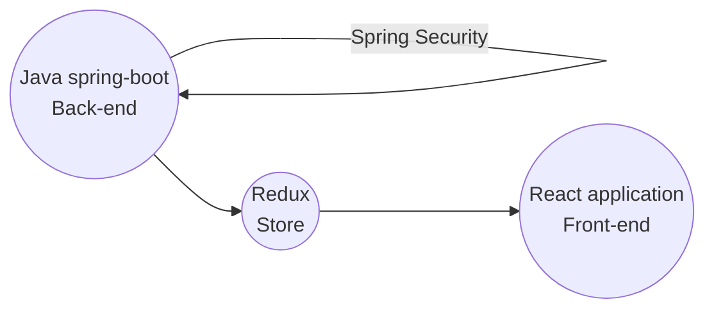

# Welcome to WorkPro

Using **Work pro** you can visually depict works of your project at various stages of a process using cards to represent project tasks and with columns to represent each stage of the process. Cards are moved from left to right to show progress

WorkPro is **Full-stack application** with **React**, **Redux** and **Spring Boot( JWT Authentication)** 

**Application Architecture** :
 Check the live site running on heroku with clever free tier msql db 
 here https://workp.herokuapp.com/

Site is up and running on heroku here https://workp.herokuapp.com/

